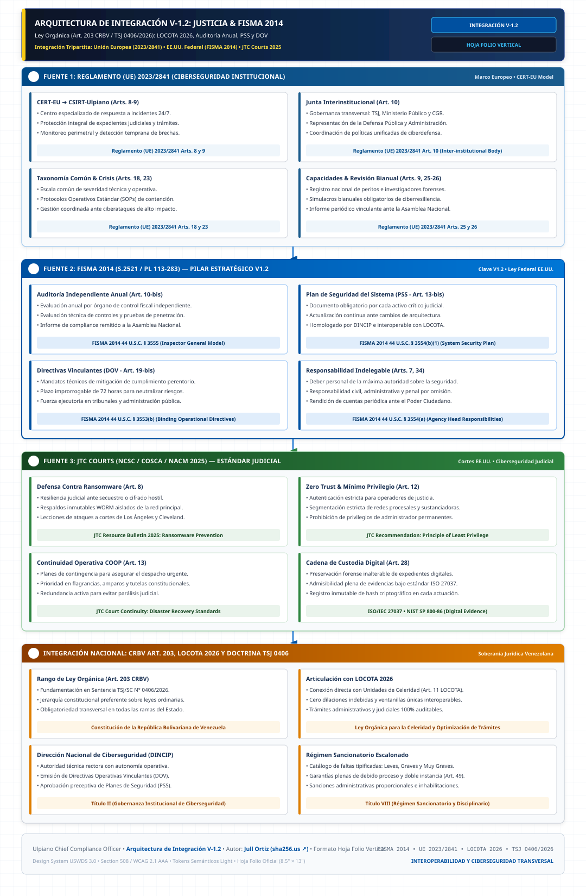

# ⚖️ Ulpiano — Chief Compliance Officer
### *Arquitectura de Ciberseguridad Procesal, Integridad Digital y Forense Judicial (V-1.2)*

[](LICENSE)
[-brightgreen.svg)]()
[-darkblue.svg)]()
[]()
[](design-system/)
[]()
[]()

---

## 📌 ¿De qué trata este proyecto?

**Ulpiano** es un modelo técnico-arquitectónico de **ciberseguridad procesal, informática forense y cumplimiento digital (*Compliance*)**, enfocado en blindar el sistema de justicia y la totalidad de la administración pública frente a vulnerabilidades externas (ciberataques) y riesgos internos (corrupción y retardo procesal).

Traduce los preceptos clásicos del jurista romano Ulpiano (*honeste vivere*, *alterum non laedere*, *suum cuique tribuere*) en una infraestructura tecnológica auditable, continua e inmutable, articulada con los más altos estándares internacionales (**Reglamento UE 2023/2841**, **FISMA 2014 S.2521**, **JTC NCSC Courts 2025**) y el bloque constitucional venezolano (**CRBV Art. 203**, **Sentencia TSJ/SC N° 0406/2026** y **LOCOTA 2026**).

---

## 🏛️ Arquitectura de Integración Maestra (V-1.2)

A continuación se ilustra la integración de los marcos comparados internacionales, la gobernanza federal y el **aporte original de integridad procesal (Título VII)**:

<p align="center">
  
</p>

### 🔍 Desglose de los 4 Grandes Bloques:

1. **🇪🇺 Bloque de Gobernanza Sectorial (Reglamento UE 2023/2841):**
   * Creación del **CSIRT-Ulpiano** (*Arts. 8 y 9*) como equipo especializado de respuesta ante incidentes en tribunales y entes públicos.
   * Adopción de la **Junta de Integridad Procesal** (*Art. 10*) y taxonomía común unificada de severidad técnica de incidentes (*Art. 18*).
2. **🇺🇸 Bloque de Gobernanza Federal & Auditoría (FISMA 2014 S.2521):**
   * **Auditoría Independiente Anual obligatoria (*Art. 10-bis*):** Evaluación externa anual por el Poder Ciudadano con informe vinculante perentorio en 90 días a la Asamblea Nacional y Contraloría General.
   * **Planes de Seguridad del Sistema — PSS (*Art. 13-bis*):** Documento formal mandatorio por cada activo crítico institucional.
   * **Directivas Operativas Vinculantes — DOV (*Art. 19-bis*):** Órdenes técnicas de cumplimiento perentorio e inaplazable en **72 horas** ante incidentes o vulnerabilidades críticas.
3. **🏛️ Bloque de Resiliencia en Cortes (JTC COSCA/NACM/NCSC 2025):**
   * Esquema **Zero Trust**, autenticación multifactor (MFA criptográfico FIDO2) y micro-segmentación de redes judiciales (*Art. 12*).
   * Planes de **Continuidad de Operaciones Judiciales (COOP)** para causas de flagrancia y amparos (*Art. 13*).
4. **⭐ Aporte de Valor Original (Integridad Procesal Anticorrupción — Título VII):**
   * **Doble Frente:** Aplicación de la ciberseguridad para fiscalizar y auditar a operadores internos frente a manipulaciones o retardo.
   * **Distribución Aleatoria Algorítmica (*Art. 26*):** Sorteo inmutable y auditable de causas sin discrecionalidad humana.
   * **Segregación "Cuatro Ojos Digital" (*Art. 27*) & Hashes SHA-256 (*Art. 28*):** Registros inalterables e inviolables incluso por administradores de bases de datos (WORM).
   * **IA Ética de Cumplimiento (*Arts. 25, 29-31*):** Alertas tempranas interoperables con la Contraloría (CGR/SUNAI) y supervisión humana obligatoria.

---

## 🧭 Módulos del Portal Web Oficial (Single-Page App)

El portal web de Ulpiano CCO incorpora 5 herramientas de control institucional:

```
┌──────────────────────────────────────────────────────────────────────────────────────────┐
│                             PORTAL OFICIAL ULPIANO CCO (V-1.2)                           │
├─────────────────┬─────────────────┬─────────────────┬──────────────────┬─────────────────┤
│ 📊 Dashboard    │ 🏛️ Diagramas     │ 📖 Lector V-1.2 │ ⚖️ Comparador    │ 📋 Matriz Excel │
├─────────────────┼─────────────────┼─────────────────┼──────────────────┼─────────────────┤
│ • KPIs y metas  │ • 5 Diagramas   │ • Lector de ley │ • Comparativa    │ • Hoja tipo     │
│   del proyecto  │   vectoriales   │   con índice    │   interactiva    │   Excel con 12  │
│ • Delta         │   SVG en HD     │   flotante      │   entre versiones│   títulos y     │
│   Inspector con │ • Zoom, pan y   │ • Salto a       │   (V1.0 vs V1.1  │   normas        │
│   búsqueda      │   fullscreen    │   reformas en   │   vs V1.2) con   │ • Exportación   │
│ • Gráficos de   │ • Desglose      │   rojo y azul   │   resaltado      │   CSV y copiado │
│   reformas      │   interactivo   │ • Tipografía    │   diferencial    │   tabular       │
└─────────────────┴─────────────────┴─────────────────┴──────────────────┴─────────────────┘
```

---

## 🖼️ Suite Oficial de Diagramas Vectoriales

El módulo de **Diagramas** ofrece visualización interactiva de 5 perspectivas especializadas:

1. [`svg/ciberseguridad_integracion_V1.2.svg`](./svg/ciberseguridad_integracion_V1.2.svg) — **Arquitectura Maestra Integral V-1.2:** Mapeo de los 4 grandes bloques integrados.
2. [`svg/arquitectura_tecnica_v1.2.svg`](./svg/arquitectura_tecnica_v1.2.svg) — **Arquitectura Técnica & Forense V-1.2:** Capas Zero Trust, CSIRT, Forense ISO 27037, PSS, DOV 72h e IA de Integridad.
3. [`svg/marco_legal_internacional_v1.2.svg`](./svg/marco_legal_internacional_v1.2.svg) — **Marco Legal Internacional & Derecho Comparado:** Reglamento UE 2023/2841, NIS2, FISMA 2014 (S.2521), JTC NCSC 2025 y Normas ISO/IEC (27001, 27037, 42001).
4. [`svg/marco_legal_nacional_v1.2.svg`](./svg/marco_legal_nacional_v1.2.svg) — **Marco Legal Nacional & Bloque Constitucional:** CRBV Art. 203 (Rango Orgánico), Sentencia TSJ 0406/2026, LOCOTA 2026 (Unidades de Celeridad Art. 11 y Comisión Nacional Art. 7), SUSCERTE y Régimen Sancionatorio.
5. [`svg/titulo_vii_idea_de_valor_v1.2.svg`](./svg/titulo_vii_idea_de_valor_v1.2.svg) — **Aporte Original Título VII:** Doble Frente, Sorteo Aleatorio Algorítmico, Segregación "4 Ojos" e IA Anticorrupción.

---

## 🎯 Doble Frente de Protección

| 🛡️ 1. Ciberseguridad (Amenazas Externas) | ⚖️ 2. Integridad Procesal (Riesgos Internos) |
| :--- | :--- |
| **Protege contra:** Ransomware, intrusiones, denegación de servicio (DDoS) y sabotaje de expedientes electrónicos. | **Mitiga:** Discrecionalidad no controlada, manipulación de causas, pérdida de pruebas y retardo procesal indebido. |
| **Mecanismos clave:**<br>• **CSIRT-Ulpiano:** Respuesta rápida ante ciberataques 24/7.<br>• **Zero Trust:** Segmentación de red y MFA FIDO2.<br>• **DOVs en 72h:** Directivas de remediación perentoria.<br>• **COOP:** Planes de continuidad operativa judicial (ISO 22301). | **Mecanismos clave:**<br>• **Distribución aleatoria:** Algoritmo público certificado (Art. 26).<br>• **Segregación "4 Ojos Digital":** Ningún operador aprueba actos en solitario (Art. 27).<br>• **Sellado Criptográfico:** Bitácoras y expedientes protegidos con SHA-256 (Art. 28).<br>• **Celeridad LOCOTA:** Unidades de celeridad y alertas de retardo. |

---

## 🧱 Componentes Clave

```
┌─────────────────────────────────────────────────────────────────────────────────────────────┐
│                                     PILAR TECNOLÓGICO                                       │
├──────────────────────────┬──────────────────────────┬───────────────────────────────────────┤
│ 🔒 Ciberseguridad & BCP  │ 🔬 Forense Digital       │ 🤖 IA, Integridad & Celeridad         │
├──────────────────────────┼──────────────────────────┼───────────────────────────────────────┤
│ • CSIRT-Ulpiano 24/7     │ • Cadena de custodia     │ • Detección de anomalías y alertas    │
│   (Reglamento UE / DINCIP│   según ISO/IEC 27037    │   en tiempo real (CGR / SUNAI)        │
│ • Zero Trust & TLS 1.3   │ • Orden de volatilidad   │ • Supervisión humana obligatoria      │
│ • Planes de Seguridad PSS│   (RFC 3227 / NIST)      │   (ISO/IEC 42001 & Art. 25)           │
│   (FISMA 2014 § 3554)    │ • Sellado SHA-256 e      │ • Sorteo algorítmico inmutable        │
│ • Directivas DOV en 72h  │   inmutabilidad WORM     │ • Segregación dual "4 Ojos Digital"   │
│ • Continuidad COOP       │ • Preparación forense    │ • Articulación con Unidades de        │
│   judicial (ISO 22301)   │   continua de sistemas   │   Celeridad (LOCOTA 2026 Art. 11)     │
└──────────────────────────┴──────────────────────────┴───────────────────────────────────────┘
```

---

## 📐 Estándares y Marcos de Referencia

- **Ciberseguridad y Resiliencia:** ISO/IEC 27001 (SGSI), ISO/IEC 27035 (Incidentes), ISO 22301 (Continuidad de Negocio), Reglamento (UE) 2023/2841, Directiva NIS2 (UE 2022/2555), FISMA 2014 (S.2521 / 44 U.S.C. § 3551-3558), NIST SP 800-53 Rev. 5, NIST SP 800-207 (Zero Trust), *Cybersecurity Basics for Courts* (COSCA/NCSC 2025).
- **Evidencia e Informática Forense:** ISO/IEC 27037, 27041, 27042, 27043, NIST SP 800-86, RFC 3227, *Manual Único de Cadena de Custodia*.
- **Gobernanza, Anticorrupción, Celeridad e IA:** ISO 37001 (Antisoborno), ISO 37301 (Cumplimiento), ISO/IEC 42001 / 23894 (Gestión de Riesgos de IA), NIST AI RMF, LOCOTA 2026 (*Ley Orgánica para la Celeridad y Optimización de Trámites Administrativos*).
- **Bloque Constitucional & Jurisprudencial:** Constitución de la República Bolivariana de Venezuela (CRBV Arts. 203, 26, 28, 49, 110, 141, 253, 254, 284) y Sentencia Vinculante TSJ/SC N° 0406/2026 (Doctrina de rango orgánico y validez probatoria del sorteo digital).
- **Diseño y Accesibilidad:** [USWDS 3.0 (U.S. Web Design System)](design-system/) — Cumplimiento Section 508 y WCAG 2.1 AAA.

---

## 📂 Estructura del Repositorio

- [`index.html`](./index.html) — Portal web interactivo principal con los 5 módulos institucionales.
- [`viewer.js`](./viewer.js) — Motor JavaScript con registro de versiones, suite de diagramas, matriz de trazabilidad y comparador.
- [`viewer.css`](./viewer.css) — Estilos del portal bajo tokens de diseño USWDS 3.0 / DC3 institucional.
- [`registry.json`](./registry.json) — Registro modular autodescubrible de versiones normativas y estadísticas.
- [`svg/`](./svg/) — Colección de diagramas vectoriales en alta resolución:
  - [`ciberseguridad_integracion_V1.2.svg`](./svg/ciberseguridad_integracion_V1.2.svg) — Arquitectura Maestra Integral V-1.2.
  - [`arquitectura_tecnica_v1.2.svg`](./svg/arquitectura_tecnica_v1.2.svg) — Arquitectura Técnica y Forense por Capas V-1.2.
  - [`marco_legal_internacional_v1.2.svg`](./svg/marco_legal_internacional_v1.2.svg) — Marco Legal Internacional y Derecho Comparado.
  - [`marco_legal_nacional_v1.2.svg`](./svg/marco_legal_nacional_v1.2.svg) — Marco Legal Nacional y Bloque Constitucional.
  - [`titulo_vii_idea_de_valor_v1.2.svg`](./svg/titulo_vii_idea_de_valor_v1.2.svg) — Aporte Original de Integridad Procesal Anticorrupción.
- [`docs/`](./docs/) — Documentos fuente en formato Markdown:
  - [`ciberseguridadprocesal_v1.2.md`](./docs/ciberseguridadprocesal_v1.2.md) — Ley Orgánica V-1.2 (FISMA 2014 + LOCOTA 2026 + Sentencia TSJ 0406/2026).
  - [`ciberseguridadprocesal_v1.1.md`](./docs/ciberseguridadprocesal_v1.1.md) — Ley Orgánica V-1.1 (Con Reformas).
  - [`ciberseguridadprocesal_V1.0.md`](./docs/ciberseguridadprocesal_V1.0.md) — Ley Especial V-1.0 (Documento Base).
- [`components/docs/`](./components/docs/) — Componentes HTML compilados para lectura ultrarrápida.
- [`design-system/`](./design-system/) — Tokens de diseño JSON/CSS bajo el estándar USWDS 3.0.
- [`build.ps1`](./build.ps1) / [`build.js`](./build.js) — Scripts de compilación automática de documentos Markdown a componentes HTML.
- [`RAG/`](./RAG/) — Base de conocimiento normativo para pipelines de IA.
- [`LICENSE`](./LICENSE) — Licencia de código abierto Apache 2.0.

---

## ⚡ Guía de Ejecución Local

Para visualizar el portal en tu entorno local:

1. **Clonar el repositorio:**
   ```bash
   git clone https://github.com/julljoll/Ulpiano-Chief-Compliance-Officer.git
   cd Ulpiano-Chief-Compliance-Officer
   ```

2. **Compilar los componentes HTML (opcional):**
   ```powershell
   powershell -ExecutionPolicy Bypass -File build.ps1
   ```

3. **Abrir en el navegador:**
   - Abre `index.html` con la extensión **Live Server** de VS Code, o con cualquier servidor web estático local (ej. `python -m http.server 8080`).

---

> 💡 **Nota de Investigación:** Este proyecto es un desarrollo técnico e investigativo enfocado en arquitectura de software seguro, informática forense, derecho procesal constitucional y modelos algorítmicos para la integridad, transparencia y celeridad de los sistemas de justicia y de la administración pública.
