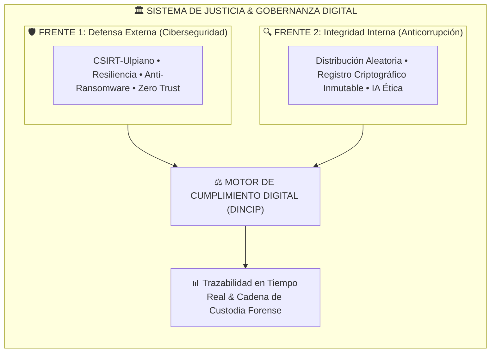

# ⚖️ Ulpiano — Chief Compliance Officer
### *Arquitectura de Ciberseguridad Procesal, Integridad Digital y Forense Judicial*

[](LICENSE)
[]()
[]()
[]()

---

## 📌 ¿De qué trata este proyecto?

**Ulpiano** es un modelo técnico-arquitectónico de **ciberseguridad procesal, informática forense y cumplimiento digital (*Compliance*)**, enfocado en blindar el sistema de justicia frente a vulnerabilidades técnicas y éticas.

Traduce los preceptos clásicos del jurista romano Ulpiano (*honeste vivere*, *alterum non laedere*, *suum cuique tribuere*) en una infraestructura tecnológica auditable, continua y verificable.



---

## 🎯 Doble Frente de Protección

| 🛡️ 1. Ciberseguridad (Amenazas Externas) | ⚖️ 2. Integridad Procesal (Riesgos Internos) |
| :--- | :--- |
| **Protege contra:** Ransomware, intrusiones, denegación de servicio y sabotaje de expedientes. | **Mitiga:** Discrecionalidad no controlada, manipulación de expedientes, pérdida de pruebas y retardo procesal inducido. |
| **Mecanismos clave:**<br>• **CSIRT-Ulpiano:** Equipo de respuesta rápida ante incidentes.<br>• Segmentación de red y principio de mínimo privilegio.<br>• Planes de continuidad operativa (COOP) para causas urgentes. | **Mecanismos clave:**<br>• **Distribución aleatoria de causas:** Algoritmo público y auditable.<br>• **Segregación "Cuatro Ojos Digital":** Ningún operador aprueba actos críticos en solitario.<br>• **Registro inmutable:** Bitácoras criptográficas protegidas con Hash. |

---

## 🧱 Componentes Clave

```
┌─────────────────────────────────────────────────────────────────────────────┐
│                            PILAR TECNOLÓGICO                                │
├──────────────────────────┬──────────────────────────┬───────────────────────┤
│ 🔒 Ciberseguridad & BCP  │ 🔬 Forense Digital       │ 🤖 IA & Cumplimiento  │
├──────────────────────────┼──────────────────────────┼───────────────────────┤
│ • Detección y respuesta  │ • Cadena de custodia     │ • Detección de        │
│   a incidentes sectorial │   según ISO/IEC 27037    │   anomalías y alertas │
│ • Cifrado en reposo y en │ • Orden de volatilidad   │ • Supervisión humana  │
│   tránsito (Zero Trust)  │   (RFC 3227 / NIST)      │   obligatoria         │
│ • Continuidad judicial   │ • Preparación forense    │ • Auditoría de sesgos │
│   operativa (ISO 22301)  │   continua en sistemas   │   (ISO/IEC 42001)     │
└──────────────────────────┴──────────────────────────┴───────────────────────┘
```

---

## 📐 Estándares y Marcos de Referencia

- **Ciberseguridad y Resiliencia:** ISO/IEC 27001, ISO/IEC 27035, ISO 22301, Reglamento (UE) 2023/2841, *Cybersecurity Basics for Courts* (COSCA/NCSC 2025).
- **Evidencia e Informática Forense:** ISO/IEC 27037, 27041, 27042, 27043, NIST SP 800-86, RFC 3227, *Manual Único de Cadena de Custodia*.
- **Gobernanza, Anticorrupción e IA:** ISO 37001 (Antisoborno), ISO 37301 (Cumplimiento), ISO/IEC 42001 / 23894 (Gestión de Riesgos de IA).

---

## 📂 Estructura del Repositorio

- [`ciberseguridadprocesal.md`](./ciberseguridadprocesal.md) — Documento técnico-jurídico base (anteproyecto y modelo de articulado).
- `RAG/` — Módulo para base de conocimiento e integración con arquitecturas de recuperación aumentada (RAG).
- `LICENSE` — Licencia del proyecto.

---

> 💡 **Nota de Investigación:** Este proyecto es un desarrollo técnico e investigativo enfocado en arquitectura de software seguro, informática forense y modelos algorítmicos para la integridad de los sistemas de justicia.
