# ⚖️ Ulpiano — Chief Compliance Officer
### *Arquitectura de Ciberseguridad Procesal, Integridad Digital y Forense Judicial*

[](LICENSE)
[]()
[](design-system/)
[]()
[]()

---

## 📌 ¿De qué trata este proyecto?

**Ulpiano** es un modelo técnico-arquitectónico de **ciberseguridad procesal, informática forense y cumplimiento digital (*Compliance*)**, enfocado en blindar el sistema de justicia frente a vulnerabilidades externas (ciberataques) y riesgos internos (corrupción y retardo procesal).

Traduce los preceptos clásicos del jurista romano Ulpiano (*honeste vivere*, *alterum non laedere*, *suum cuique tribuere*) en una infraestructura tecnológica auditable, continua e inmutable.

---

## 🏛️ Arquitectura de Integración del Sistema

A continuación se ilustra la integración de los marcos comparados internacionales y el **aporte original de integridad procesal (Título VII)**:

<p align="center">
  
</p>

### 🔍 Desglose de la Arquitectura:

1. **🇪🇺 Bloque de Gobernanza Sectorial (Reglamento UE 2023/2841):**
   * Creación del **CSIRT-Ulpiano** (*Arts. 8 y 9*) como equipo especializado de respuesta ante incidentes en tribunales.
   * Adopción de la **Junta de Integridad Procesal** (*Art. 10*) y taxonomía común de severidad de incidentes (*Art. 18*).
2. **🏛️ Bloque de Resiliencia en Cortes (JTC COSCA/NACM/NCSC 2025):**
   * Esquema **Zero Trust**, autenticación multifactor (MFA) y segmentación de redes judiciales (*Art. 12*).
   * Planes de **Continuidad de Operaciones Judiciales (COOP)** para causas de flagrancia y amparos (*Art. 13*).
3. **⭐ Aporte de Valor Original (Integridad Procesal Anticorrupción — Título VII):**
   * **Doble Frente:** Aplicación de la ciberseguridad para fiscalizar y auditar a operadores internos.
   * **Distribución Aleatoria Algorítmica (*Art. 26*):** Sorteo inmutable y auditable de causas sin discrecionalidad humana.
   * **Segregación "Cuatro Ojos Digital" (*Art. 27*) & Hashes (*Art. 28*):** Registros inalterables por administradores.
   * **IA Ética de Cumplimiento (*Arts. 25, 29-31*):** Alertas tempranas interoperables con la Contraloría, con supervisión humana obligatoria.

---

## 🎯 Doble Frente de Protección

| 🛡️ 1. Ciberseguridad (Amenazas Externas) | ⚖️ 2. Integridad Procesal (Riesgos Internos) |
| :--- | :--- |
| **Protege contra:** Ransomware, intrusiones, denegación de servicio y sabotaje de expedientes. | **Mitiga:** Discrecionalidad no controlada, manipulación de causas, pérdida de pruebas y retardo procesal. |
| **Mecanismos clave:**<br>• **CSIRT-Ulpiano:** Respuesta rápida ante ciberataques.<br>• Segmentación de red y principio de mínimo privilegio.<br>• Planes de continuidad operativa (COOP) ante caídas de red. | **Mecanismos clave:**<br>• **Distribución aleatoria de causas:** Algoritmo público certificado.<br>• **Segregación "Cuatro Ojos Digital":** Ningún operador aprueba actos en solitario.<br>• **Registro inmutable:** Bitácoras criptográficas protegidas con Hash. |

---

## 🧱 Componentes Clave

```
┌─────────────────────────────────────────────────────────────────────────────┐
│                            PILAR TECNOLÓGICO                                │
├──────────────────────────┬──────────────────────────┬───────────────────────┤
│ 🔒 Ciberseguridad & BCP  │ 🔬 Forense Digital       │ 🤖 IA & Cumplimiento  │
├──────────────────────────┼──────────────────────────┼───────────────────────┤
│ • Detección y respuesta  │ • Cadena de custodia     │ • Detección de        │
│   a incidentes sectorial │   según ISO/IEC 27037    │   anomalías y alertas │
│ • Cifrado en reposo y en │ • Orden de volatilidad   │ • Supervisión humana  │
│   tránsito (Zero Trust)  │   (RFC 3227 / NIST)      │   obligatoria         │
│ • Continuidad judicial   │ • Preparación forense    │ • Auditoría de sesgos │
│   operativa (ISO 22301)  │   continua en sistemas   │   (ISO/IEC 42001)     │
└──────────────────────────┴──────────────────────────┴───────────────────────┘
```

---

## 📐 Estándares y Marcos de Referencia

- **Ciberseguridad y Resiliencia:** ISO/IEC 27001, ISO/IEC 27035, ISO 22301, Reglamento (UE) 2023/2841, *Cybersecurity Basics for Courts* (COSCA/NCSC 2025).
- **Evidencia e Informática Forense:** ISO/IEC 27037, 27041, 27042, 27043, NIST SP 800-86, RFC 3227, *Manual Único de Cadena de Custodia*.
- **Gobernanza, Anticorrupción e IA:** ISO 37001 (Antisoborno), ISO 37301 (Cumplimiento), ISO/IEC 42001 / 23894 (Gestión de Riesgos de IA).
- **Diseño y Accesibilidad:** [USWDS 3.0 (U.S. Web Design System)](design-system/) — Cumplimiento Section 508 y WCAG 2.1 AAA.

---

## 📂 Estructura del Repositorio

- [`ciberseguridad_integracion.svg`](./ciberseguridad_integracion.svg) — Diagrama visual de la arquitectura del sistema y aporte original.
- [`ciberseguridadprocesal.md`](./ciberseguridadprocesal.md) — Documento técnico-jurídico base (anteproyecto y modelo de articulado).
- [`design-system/`](./design-system/) — Tokens de diseño JSON/CSS bajo el estándar USWDS 3.0.
- `RAG/` — Base de conocimiento normativo y de ciberseguridad para pipelines de IA.
- `LICENSE` — Licencia de código abierto del proyecto.

---

> 💡 **Nota de Investigación:** Este proyecto es un desarrollo técnico e investigativo enfocado en arquitectura de software seguro, informática forense y modelos algorítmicos para la integridad y transparencia de los sistemas de justicia.
