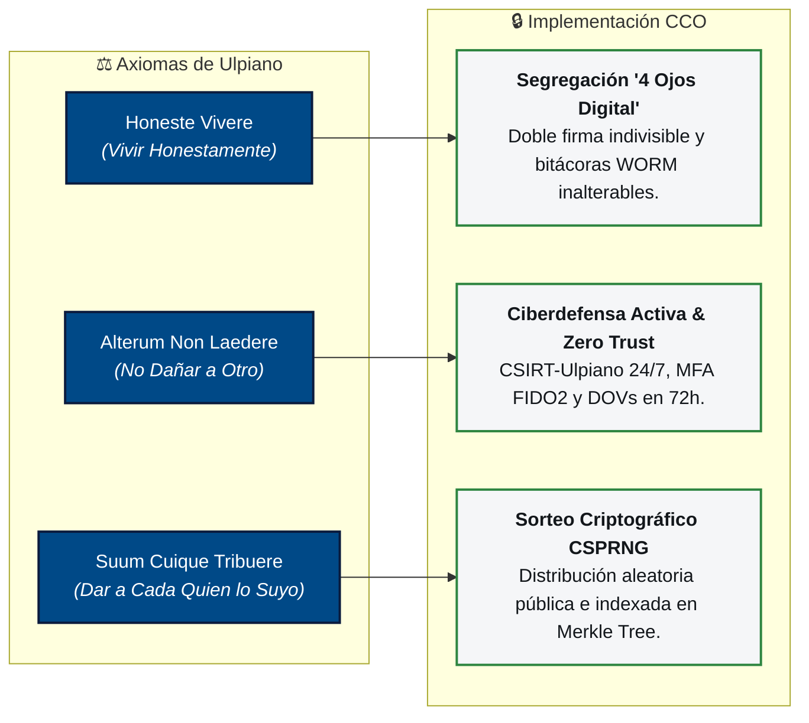
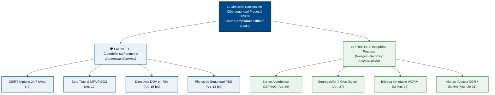
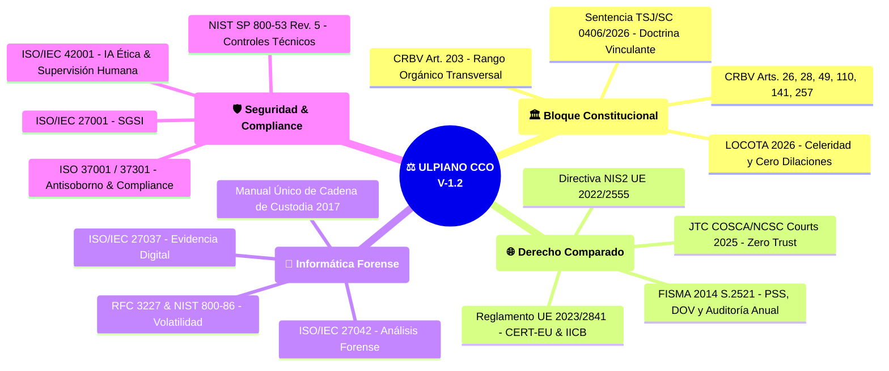

# ⚖️ Ulpiano — Chief Compliance Officer (CCO)
### *Arquitectura de Ciberseguridad Procesal, Integridad Digital y Forense Judicial (V-1.2)*

<p align="center">
  
</p>

<p align="center">
  <a href="LICENSE"></a>
  
  
  
  
  
  
</p>

---

## 📑 Tabla de Contenidos

1. [🎯 1. La Idea Central (¿Qué es Ulpiano CCO?)](#-1-la-idea-central-qué-es-ulpiano-cco)
2. [⚠️ 2. El Problema (Diagnóstico y Pain Points)](#️-2-el-problema-diagnóstico-y-pain-points)
3. [💡 3. La Solución: Tesis del Doble Frente](#-3-la-solución-tesis-del-doble-frente)
4. [⚙️ 4. ¿Cómo Funciona? (Guía Técnica Paso a Paso)](#️-4-cómo-funciona-guía-técnica-paso-a-paso)
5. [🏛️ 5. Los 4 Grandes Bloques Arquitectónicos](#️-5-los-4-grandes-bloques-arquitectónicos)
6. [🧭 6. El Portal Web Oficial (SPA con 6 Módulos)](#-6-el-portal-web-oficial-spa-con-6-módulos)
7. [🖼️ 7. Suite de 9 Perspectivas Vectoriales](#️-7-suite-de-9-perspectivas-vectoriales)
8. [📐 8. Marcos Normativos y Estándares Internacionales](#-8-marcos-normativos-y-estándares-internacionales)
9. [💻 9. Pila Tecnológica & Arquitectura de Software](#-9-pila-tecnológica--arquitectura-de-software)
10. [📂 10. Estructura del Repositorio](#-10-estructura-del-repositorio)
11. [⚡ 11. Guía de Instalación y Ejecución Local](#-11-guía-de-instalación-y-ejecución-local)
12. [📄 12. Licencia y Reconocimientos](#-12-licencia-y-reconocimientos)

---

## 🎯 1. La Idea Central (¿Qué es Ulpiano CCO?)

**Ulpiano CCO** nace de una pregunta fundamental:  
*¿Puede la ciberseguridad usarse no solo para proteger a las instituciones de ciberataques externos, sino como una herramienta activa y determinística para erradicar la corrupción, el amaño de expedientes y el retardo procesal?*

La respuesta es este modelo técnico-jurídico que traduce los tres axiomas del jurista romano **Domicio Ulpiano (Siglo III d.C.)** en algoritmos, protocolos criptográficos y controles de software inmutables:



> [!IMPORTANT]
> **Jerarquía Constitucional Preferente (Art. 203 CRBV):** Conforme a la doctrina vinculante fijada en la **Sentencia TSJ/SC N° 0406/2026**, esta propuesta tiene rango formal y material de **Ley Orgánica**, primando sobre cualquier ley ordinaria para obligar a todos los órganos del Poder Judicial, Ministerio Público, Defensa Pública y Administración Pública Nacional.

### 👥 ¿Para quién es este proyecto?

| Perfil | Lo que encontrará en este repositorio | Beneficio directo |
| :--- | :--- | :--- |
| **🏛️ Juristas & Legisladores** | Anteproyecto normativo de 47 artículos articulado con CRBV, FISMA y UE. | Marco legal listo para debate con fundamentación dogmática sólida. |
| **💻 Ingenieros de Software** | Arquitectura modular ESM, backend Python 3.12 (FastAPI), HSM y Next.js. | Especificación técnica de software judicial con criptografía real. |
| **🔬 Informáticos Forenses** | Protocolos de cadena de custodia ISO/IEC 27037 y sellado dual SHA-256 / SHA3. | Estándar técnico de evidencia digital con inmutabilidad WORM. |
| **🏢 Auditores & Compliance** | Matrices de riesgo, controles NIST SP 800-53 e IA ética bajo ISO/IEC 42001. | Hoja de ruta para auditorías anuales independientes vinculantes. |

---

## ⚠️ 2. El Problema (Diagnóstico y Pain Points)

> [!CAUTION]
> **Diagnóstico del Sistema Actual:** La opacidad procesal, la discrecionalidad en la asignación de jueces y la vulnerabilidad de las bases de datos tradicionales frente a accesos privilegiados constituyen los mayores riesgos de integridad institucional.

| # | Falla Crítica del Sistema Tradicional | Consecuencia Observable | Solución en Ulpiano CCO |
| :-: | :--- | :--- | :--- |
| **1** | **Sorteo manual o discrecional de causas** | Asignación dirigida de expedientes a tribunales o ponentes específicos. | **Art. 26:** Sorteo determinístico por CSPRNG (`secrets.SystemRandom`) auditable. |
| **2** | **Aprobación unilateral de resoluciones** | Un solo usuario con clave puede emitir autos sin verificación de secretaría. | **Art. 27:** Segregación "4 Ojos Digital" con firma dual mancomunada obligatoria. |
| **3** | **Bases de datos SQL modificables por DBAs** | Un administrador de sistemas puede alterar fechas o sentencias retroactivamente. | **Art. 28:** Almacenamiento en Bóveda WORM MinIO con Object Lock y sellado SHA-256. |
| **4** | **Inexistencia de auditorías técnicas externas** | Los sistemas judiciales operan años sin evaluación independiente de seguridad. | **Art. 10-bis:** Auditoría Anual Independiente obligatoria (modelo FISMA § 3555). |
| **5** | **Falta de facultades coercitivas del CSIRT** | Las alertas de seguridad son meras sugerencias que los entes suelen ignorar. | **Art. 19-bis:** Directivas Operativas Vinculantes (DOV) con plazo perentorio de 72h. |
| **6** | **Riesgo de automatización sin juez (IA Opaca)** | Peligro de fallos generados por algoritmos sin responsabilidad civil ni penal. | **Art. 25:** Prohibición expresa de sentencias automáticas y supervisión humana (ISO 42001). |

---

## 💡 3. La Solución: Tesis del Doble Frente

La innovación central de Ulpiano CCO es su **Tesis del Doble Frente**: una arquitectura integral donde la ciberseguridad actúa simultáneamente hacia afuera (protegiendo la infraestructura) y hacia adentro (fiscalizando las actuaciones procesales).



### 📊 Comparativa Operativa de los Dos Frentes

| Dimensión | 🛡️ Frente 1: Ciberdefensa (Externo) | ⚖️ Frente 2: Integridad Procesal (Interno) |
| :--- | :--- | :--- |
| **Amenaza combatida** | Ransomware, malware, ataques DDoS, espionaje y exfiltración. | Retardo procesal, corrupción, extravío de causas y alteración de fallos. |
| **Estándar base** | **Reglamento (UE) 2023/2841** & **FISMA 2014 (S.2521)** | **Título VII Anteproyecto** & **LOCOTA 2026** |
| **Mando técnico** | CSIRT-Ulpiano con monitoreo de telemetría en tiempo real. | Oficina de Cumplimiento Digital (CCO) y Auditoría Ciudadana. |
| **Mecanismo clave** | Aislamiento de red, contingencia COOP y remediación obligatoria. | Doble firma electrónica, sellado TSA RFC 3161 y sorteo sin azar manipulable. |

---

## ⚙️ 4. ¿Cómo Funciona? (Guía Técnica Paso a Paso)

A continuación se describe el ciclo de vida completo de una actuación judicial bajo la arquitectura Ulpiano CCO:

```
 Ciudadano / Operador            Frontend Web SPA              Backend API (FastAPI)           Bóveda WORM & Entes
┌────────────────────┐         ┌──────────────────┐          ┌───────────────────────┐        ┌──────────────────┐
│  1. Acceso Portal  │ ──────> │ Router ESModules │          │                       │        │                  │
│  2. Sorteo Causa   │ ──────> │ CSPRNG WebCrypto │ ───────> │ secrets.SystemRandom  │ ─────> │ Merkle Tree      │
│  3. Firma Dual     │ ──────> │ WebAuthn FIDO2   │ ───────> │ PyKCS11 HSM + pyHanko │ ─────> │ MinIO S3 (WORM)  │
│  4. Cotejo CSV/QR  │ ──────> │ Lector de Código │ ───────> │ Verificación Hash     │ ─────> │ Hash SHA-256 OK  │
│  5. Alerta Retardo │         │ Eventos Live WSS │ <─────── │ Workers Celery / IA   │ ─────> │ Alerta CGR/SUNAI │
└────────────────────┘         └──────────────────┘          └───────────────────────┘        └──────────────────┘
```

### 🔹 Paso 1: Inicialización Segura del Portal SPA
* **Qué ocurre:** El usuario abre [`index.html`](./index.html). El archivo [`viewer.js`](./viewer.js) carga los 12 módulos de [`modules/`](./modules/) como ESModules nativos.
* **Técnica:** [`modules/registry.js`](./modules/registry.js) descarga [`registry.json`](./registry.json) (fuente única de verdad). [`modules/router.js`](./modules/router.js) detecta el hash de la URL (`#dashboard`, `#reader`, etc.) y aplica transiciones fluidas con **Skeleton Loaders**.

### 🔹 Paso 2: Sorteo Determinístico de la Causa (Art. 26)
* **Qué ocurre:** Al ingresar una causa, el sistema asigna el magistrado o juez de forma matemáticamente inalterable.
* **Técnica:** Se genera una semilla criptosegura utilizando `crypto.getRandomValues()` en el cliente o `secrets.SystemRandom` en Python (FastAPI). El resultado se indexa en un **Árbol de Merkle**, imposibilitando cualquier alteración retroactiva.

### 🔹 Paso 3: Segregación "4 Ojos" y Firma Digital PAdES (Arts. 27 y 28)
* **Qué ocurre:** Una sentencia judicial no tiene validez legal si solo cuenta con una firma digital.
* **Técnica:** Se exige la firma sucesiva e indivisible del Juez Ponente y del Secretario de Sala mediante tokens hardware HSM (FIPS 140-2 Nivel 3) a través de `PyKCS11`. El documento se firma en formato **PAdES-B-LTA (ISO 19005-2 PDF/A-2u)** con sellado de tiempo TSA RFC 3161 de SUSCERTE.

### 🔹 Paso 4: Almacenamiento en Bóveda WORM Inmutable (Art. 28)
* **Qué ocurre:** El archivo firmado se deposita en una bóveda digital protegida contra escritura y borrado.
* **Técnica:** Se envía a un bucket MinIO S3 con **Object Lock en modo COMPLIANCE**. Ni siquiera el administrador de bases de datos (DBA) ni el superusuario del servidor pueden alterar o eliminar el expediente. Se expide un Código Seguro de Verificación (CSV).

### 🔹 Paso 5: Cotejo Público Universal y Transparencia
* **Qué ocurre:** Cualquier ciudadano o abogado puede verificar la autenticidad del documento escaneando el código QR o ingresando el código CSV en el portal.
* **Técnica:** La API recalcula el hash dual **SHA-256 + SHA3-512** en milisegundos y valida el estado del certificado ante la lista de revocación OCSP de SUSCERTE.

### 🔹 Paso 6: Radar de Alertas Tempranas por IA Ética (Arts. 25, 29-31)
* **Qué ocurre:** Si una causa supera los lapsos perentorios establecidos en la LOCOTA 2026 sin actuación justificada, se activa una alerta automática.
* **Técnica:** Workers asíncronos en Celery procesan eventos y emiten notificaciones vía WebSockets hacia la Contraloría General de la República (CGR) y la Superintendencia Nacional de Auditoría Interna (SUNAI). **La IA tiene prohibido emitir resoluciones automáticas (Art. 25).**

---

## 🏛️ 5. Los 4 Grandes Bloques Arquitectónicos

```
┌─────────────────────────────────────────────────────────────────────────────────────────────────────────────┐
│                                    ARQUITECTURA DE INTEGRACIÓN MAESTRA V-1.2                                │
├──────────────────────────────┬──────────────────────────────┬──────────────────────────────┬────────────────┤
│ 🇪🇺 1. GOBERNANZA SECTORIAL    │ 🇺🇸 2. AUDITORÍA FEDERAL      │ 🏛️ 3. RESILIENCIA EN CORTES   │ ⭐ 4. TÍTULO VII│
│    (Reglamento UE 2023/2841) │    (FISMA 2014 S.2521)       │    (JTC COSCA / NCSC 2025)   │    (Integridad)│
├──────────────────────────────┼──────────────────────────────┼──────────────────────────────┼────────────────┤
│ • CSIRT-Ulpiano judicial     │ • Auditoría Independiente    │ • Arquitectura Zero Trust    │ • Doble Frente │
│ • Junta de Integridad        │   Anual (Art. 10-bis)        │ • MFA criptográfico FIDO2    │ • Sorteo CSPRNG│
│ • Taxonomía unificada de     │ • Planes de Seguridad (PSS)  │ • Continuidad Judicial (COOP)│ • 4 Ojos Digital│
│   severidad de incidentes    │ • Directivas DOV en 72 horas │ • Resguardo desconectado     │ • Bóveda WORM  │
│ • Deber de notificación 24h  │ • Reporte a la AN y CGR      │   (Air-Gapped) anti-ransom   │ • IA Auditora  │
└──────────────────────────────┴──────────────────────────────┴──────────────────────────────┴────────────────┘
```

### 🇪🇺 Bloque 1: Gobernanza Sectorial (Reglamento UE 2023/2841)
* Adopta el esquema de gobernanza del CERT-EU como **CSIRT-Ulpiano** (*Arts. 8 y 9*).
* Crea la **Junta Interinstitucional de Ciberseguridad Procesal** (*Art. 10*).
* Estandariza la taxonomía común de incidentes y el reporte obligatorio en menos de 24 horas (*Art. 18*).

### 🇺🇸 Bloque 2: Auditoría Federal & Control (FISMA 2014 S.2521)
* **Auditoría Anual Independiente (*Art. 10-bis*):** Evaluación obligatoria contratada por el Poder Ciudadano con informe vinculante a la Asamblea Nacional y al TSJ.
* **Planes de Seguridad del Sistema - PSS (*Art. 13-bis*):** Documento técnico obligatorio por cada sistema de información crítico con asignación de responsables.
* **Directivas Operativas Vinculantes - DOV (*Art. 19-bis*):** Órdenes técnicas ejecutivas con plazo perentorio de 72 horas para contención de incidentes.

### 🏛️ Bloque 3: Resiliencia en Sedes Judiciales (JTC NCSC 2025)
* Implementación de micro-segmentación y esquema **Zero Trust** (*Art. 12*).
* Autenticación hardware resistente a phishing (FIDO2 WebAuthn).
* Planes de **Continuidad de Operaciones Judiciales (COOP)** para flagrancias y amparos (*Art. 13*).
* Copias de respaldo aisladas (air-gapped) protegidas contra ransomware.

### ⭐ Bloque 4: Integridad Procesal y Celeridad (Título VII Original)
* Sorteo algorítmico inmutable con auditoría de entropía (*Art. 26*).
* Segregación dual "4 Ojos Digital" (*Art. 27*) y sellado criptográfico WORM (*Art. 28*).
* IA ética para alertas tempranas de retardo procesal articulada con la **LOCOTA 2026** (*Arts. 25, 29-31*).

---

## 🧭 6. El Portal Web Oficial (SPA con 6 Módulos)

El portal institucional disponible en este repositorio integra 6 herramientas de análisis y control:

```
┌────────────────────────────────────────────────────────────────────────────────────────────────────────┐
│                                   PORTAL OFICIAL ULPIANO CCO (V-1.2)                                   │
├──────────────────┬──────────────────┬──────────────────┬──────────────────┬────────────────────────────┤
│ 📊 Dashboard     │ 🏛️ Diagramas     │ 🐍 Consola API   │ 📖 Lector V-1.2  │ ⚖️ Comparador & 📋 Matriz   │
├──────────────────┼──────────────────┼──────────────────┼──────────────────┼────────────────────────────┤
│ • 4 KPIs reales  │ • 9 Perspectivas │ • Firma PAdES    │ • Visor de Ley   │ • Comparativa paralela     │
│ • Delta          │   vectoriales SVG│   con HSM L3     │   con TOC flotante│ • Resaltado de reformas    │
│   Inspector con  │ • Zoom dinámico  │ • Cotejo CSV     │   interactivo    │ • Matriz tipo Excel con 12 │
│   buscador       │ • Fullscreen     │ • Sorteo CSPRNG  │ • Salto a cambios│   títulos y exportación CSV│
│ • Gráficos       │ • Descarga HD    │ • Alertas WSS    │   en rojo y azul │   con codificación UTF-8   │
└──────────────────┴──────────────────┴──────────────────┴──────────────────┴────────────────────────────┘
```

| Módulo | Módulo JS Asociado | Propósito y Funcionalidad |
| :--- | :--- | :--- |
| **📊 Dashboard de Mejoras** | [`dashboard.js`](./modules/dashboard.js) & [`charts.js`](./modules/charts.js) | Panel de control ejecutivo con KPIs, desglose de las 3 grandes reformas estructurales, gráficos estadísticos y Delta Inspector. |
| **🏛️ Diagramas (9 Vistas)** | [`diagrams.js`](./modules/diagrams.js) & [`diagrams-registry.js`](./modules/diagrams-registry.js) | Suite de visualización de los 9 diagramas de arquitectura vectorial con zoom interactivo (50%-250%), pantalla completa y descarga SVG. |
| **🐍 Consola API Python** | [`api-sim.js`](./modules/api-sim.js) | Simulador interactivo de endpoints FastAPI: firma PAdES con HSM, cotejo CSV inmutable, sorteo CSPRNG y alertas en vivo vía WebSocket. |
| **📖 Lector de Versiones** | [`reader.js`](./modules/reader.js) | Lector documental con índice flotante dinámico (`IntersectionObserver`), selector de tipografía y botón para saltar secuencialmente entre reformas. |
| **⚖️ Comparador de Versiones**| [`compare.js`](./modules/compare.js) | Vista split-screen para cotejo lado a lado de dos versiones (V1.0 vs V1.1 vs V1.2) con sincronización de lectura. |
| **📋 Matriz de Trazabilidad**| [`matrix.js`](./modules/matrix.js) | Cuadrícula tabular interactiva tipo Excel con filtros por pestañas normativas, copiado al portapapeles y exportación a archivo CSV con UTF-8 BOM. |

---

## 🖼️ 7. Suite de 9 Perspectivas Vectoriales

Todos los diagramas del proyecto son archivos SVG vectoriales puros, editables, con modo claro institucional y tipografía estandarizada:

1. [`svg/ciberseguridad_integracion_V1.2.svg`](./svg/ciberseguridad_integracion_V1.2.svg) — **Arquitectura Maestra Integral V-1.2:** Mapeo completo de los 4 grandes bloques de gobernanza.
2. [`svg/cms_compliance_organigrama_descendente.svg`](./svg/cms_compliance_organigrama_descendente.svg) — **Organigrama Funcional Descendente:** Jerarquía institucional de control, dos pilares (Workflows vs IA) y 4 estratos.
3. [`svg/cms_compliance_workflows_arquitectura.svg`](./svg/cms_compliance_workflows_arquitectura.svg) — **CMS Compliance Officer: Workflows & Alertas IA:** Pipelines programáticos code-based (sin interfaz gráfica) y radar de alertas.
4. [`svg/backend_python_api_arquitectura.svg`](./svg/backend_python_api_arquitectura.svg) — **Servidor Backend API en Python (FastAPI):** Ingress TLS 1.3, PKI SUSCERTE, Celery/Redis, pgvector RAG y Bóveda WORM MinIO.
5. [`svg/tsj_arquitectura_frontend.svg`](./svg/tsj_arquitectura_frontend.svg) — **Portal Judicial TSJ: Frontend Web en Next.js 15:** Visor Forense React-PDF, tokens USWDS 3.0, accesibilidad WCAG AAA y WebAuthn FIDO2.
6. [`svg/arquitectura_tecnica_v1.2.svg`](./svg/arquitectura_tecnica_v1.2.svg) — **Arquitectura Técnica & Forense V-1.2:** Capas Zero Trust, CSIRT, Forense ISO 27037 y Bóveda WORM.
7. [`svg/marco_legal_internacional_v1.2.svg`](./svg/marco_legal_internacional_v1.2.svg) — **Derecho Comparado:** Articulación con Reglamento UE 2023/2841, NIS2, FISMA 2014, JTC NCSC 2025 e ISOs.
8. [`svg/marco_legal_nacional_v1.2.svg`](./svg/marco_legal_nacional_v1.2.svg) — **Bloque Constitucional:** CRBV Art. 203 (Ley Orgánica), Sentencia TSJ 0406/2026 y LOCOTA 2026.
9. [`svg/titulo_vii_idea_de_valor_v1.2.svg`](./svg/titulo_vii_idea_de_valor_v1.2.svg) — **Aporte Original Título VII:** Doble Frente, Sorteo Algorítmico, Segregación "4 Ojos" e IA Ética.

---

## 📐 8. Marcos Normativos y Estándares Internacionales



---

## 💻 9. Pila Tecnológica & Arquitectura de Software

### Capas del Sistema Global:

```
┌────────────────────────────────────────────────────────────────────────────────────────┐
│ CAPA 1: PRESENTATION & UX JUDICIAL (Next.js 15 App Router / React-PDF / USWDS 3.0)     │
├────────────────────────────────────────────────────────────────────────────────────────┤
│ CAPA 2: INGRESS, API GATEWAY & AUTH (FastAPI / Uvicorn / TLS 1.3 / OAuth2 FIDO2)       │
├────────────────────────────────────────────────────────────────────────────────────────┤
│ CAPA 3: MOTOR CRIPTOGRÁFICO JUDICIAL (PyKCS11 HSM / pyHanko PAdES-B-LTA / TSA RFC 3161)│
├────────────────────────────────────────────────────────────────────────────────────────┤
│ CAPA 4: WORKERS ASÍNCRONOS & IA ÉTICA (Celery / Redis / pgvector RAG / ISO 42001)       │
├────────────────────────────────────────────────────────────────────────────────────────┤
│ CAPA 5: PERSISTENCIA E INMUTABILIDAD (PostgreSQL 16 / MinIO S3 WORM / Merkle Tree Log) │
└────────────────────────────────────────────────────────────────────────────────────────┘
```

### Tecnologías Implementadas en este Repositorio:

| Componente | Tecnología | Versión / Tipo | Propósito |
| :--- | :--- | :--- | :--- |
| **Core Lógico** | JavaScript (ESM) | ES2022 Nativo | Modularidad sin dependencias de empaquetado ni frameworks pesados. |
| **Design System** | USWDS 3.0 / Bootstrap | 5.3.3 Custom Tokens | Paleta oficial, tipografía legible y cumplimiento estricto WCAG 2.1 AAA. |
| **Gráficos** | Chart.js | CDN v4.x | Renderizado reactivo de la distribución de reformas y competencias. |
| **Parser Markdown** | Marked.js | CDN v14.x | Conversión segura de fuentes Markdown a HTML con soporte de tablas. |
| **Iconografía** | Google Material Symbols | Outlined | Señalética visual institucional y técnica estandarizada. |
| **Seguridad Web** | Apache `.htaccess` | HSTS / CSP / MIME | Protección contra ataques XSS, clickjacking, MIME sniffing y caché optimizado. |

---

## 📂 10. Estructura del Repositorio

```
Ulpiano-Chief-Compliance-Officer/
├── index.html                  # Portal SPA interactivo (6 módulos institucionales)
├── viewer.js                   # Punto de entrada JavaScript (ESModule desacoplado)
├── viewer.css                  # Estilos USWDS 3.0 / Skeleton loaders / Media print
├── registry.json               # Fuente única de verdad: metadatos, versiones y KPIs
├── manifest.json               # Manifiesto Web App (PWA) para soporte móvil y desktop
├── package.json                # Metadata, scripts de compilación, linting y formateo
├── .htaccess                   # Cabeceras de seguridad HTTP, Content Security Policy y caché
├── .eslintrc.json              # Reglas de control estático de código JavaScript (ES2022)
├── .prettierrc                 # Estándar de formato de código
│
├── modules/                    # 🧩 Arquitectura Modular Desacoplada (ESModules)
│   ├── state.js                # Singleton reactivo del estado de la aplicación
│   ├── utils.js                # Funciones de escape XSS y control tipográfico
│   ├── registry.js             # Gestor dinámico de registry.json y catálogo de reformas
│   ├── router.js               # Enrutador SPA con soporte de URL Hash e historial
│   ├── dashboard.js            # KPIs ejecutivos, tarjetas de versión y Delta Explorer
│   ├── charts.js               # Gráficos dinámicos con Chart.js
│   ├── reader.js               # Visor documental con TOC flotante e IntersectionObserver
│   ├── diagrams-registry.js    # Metadatos y desglose de las 9 perspectivas vectoriales
│   ├── diagrams.js             # Controlador SVG con zoom (50%-250%), fullscreen y descarga
│   ├── compare.js              # Comparador split-screen paralelo entre versiones
│   ├── matrix.js               # Matriz tipo Excel con filtros y exportación CSV UTF-8
│   └── api-sim.js              # Simuladores interactivos con CSPRNG Web Crypto real
│
├── svg/                        # 🖼️ Suite de 9 Diagramas Vectoriales en Alta Resolución
│   ├── ciberseguridad_integracion_V1.2.svg
│   ├── cms_compliance_organigrama_descendente.svg
│   ├── cms_compliance_workflows_arquitectura.svg
│   ├── backend_python_api_arquitectura.svg
│   ├── tsj_arquitectura_frontend.svg
│   ├── arquitectura_tecnica_v1.2.svg
│   ├── marco_legal_internacional_v1.2.svg
│   ├── marco_legal_nacional_v1.2.svg
│   └── titulo_vii_idea_de_valor_v1.2.svg
│
├── design-system/              # 🎨 Tokens de Diseño USWDS 3.0 / DC3
│   ├── tokens.css              # Variables de color, elevación y espaciado
│   ├── tokens.json             # Design Tokens en formato estructurado JSON
│   ├── components.css          # Componentes de interfaz judicial
│   └── tech_icons_defs.svg     # Definiciones de iconos vectoriales
│
├── docs/                       # 📜 Fuentes Normativas Originales en Markdown
│   ├── ciberseguridadprocesal_v1.2.md  # Versión 1.2 Orgánica (FISMA + LOCOTA)
│   ├── ciberseguridadprocesal_v1.1.md  # Versión 1.1 Orgánica (Con Reformas)
│   └── ciberseguridadprocesal_V1.0.md  # Versión 1.0 Especial (Documento Base)
│
├── components/docs/            # ⚡ Componentes HTML precompilados para lectura instantánea
│   ├── v1.2.html
│   ├── v1.1.html
│   └── v1.0.html
│
├── .github/workflows/          # 🤖 Pipeline de Integración Continua (CI/CD)
│   └── build.yml
│
├── build.js                    # Compilador Markdown -> HTML en Node.js (con modo --watch)
├── build.ps1                   # Compilador Markdown -> HTML en PowerShell
├── RAG/                        # Base de conocimiento normativo para pipelines de IA
└── LICENSE                     # Licencia Apache 2.0
```

---

## ⚡ 11. Guía de Instalación y Ejecución Local

> [!WARNING]
> **Requisito de Servidor Web:** Debido a que el portal utiliza **ESModules nativos** y llamadas `fetch()` para consultar los componentes y diagramas SVG, **no debe abrirse mediante doble clic (`file:///`)**, sino a través de un servidor HTTP local.

### Prerrequisitos:
* Navegador web moderno compatible con ESModules (Chrome 61+, Firefox 60+, Edge 79+, Safari 10.1+).
* Servidor web estático local (VS Code Live Server, Python o Node.js).

### Paso a Paso:

1. **Clonar el repositorio:**
   ```bash
   git clone https://github.com/julljoll/Ulpiano-Chief-Compliance-Officer.git
   cd Ulpiano-Chief-Compliance-Officer
   ```

2. **Compilar componentes normativos (opcional al editar los `.md`):**
   * Con Node.js:
     ```bash
     node build.js
     # O activar el observador de cambios:
     node build.js --watch
     ```
   * Con PowerShell (Windows):
     ```powershell
     powershell -ExecutionPolicy Bypass -File build.ps1
     ```

3. **Iniciar el servidor local (elige una opción):**
   * **Opción A (VS Code):** Clic derecho en `index.html` → **Open with Live Server**.
   * **Opción B (Python 3):**
     ```bash
     python -m http.server 8080
     ```
   * **Opción C (Node.js / npx):**
     ```bash
     npx live-server --port=8080
     ```

4. **Explorar el portal:**
   * Abre tu navegador en `http://localhost:8080` para navegar por los 6 módulos institucionales.

---

## 📄 12. Licencia y Reconocimientos

* **Licencia:** Distribuido bajo los términos de la Licencia de Código Abierto [Apache 2.0](LICENSE).
* **Autor / Investigador:** **Jull Ortiz** ([sha256.us ↗](https://sha256.us/)).
* **Estándar de Diseño:** [U.S. Web Design System (USWDS 3.0)](https://designsystem.digital.gov/) adaptado para instituciones del sector público y conforme a Section 508 / WCAG 2.1 AAA.

---

<p align="center">
  <i>«Iuris praecepta sunt haec: honeste vivere, alterum non laedere, suum cuique tribuere.»</i><br>
  <b>— Domicio Ulpiano (170–223 d.C.)</b>
</p>
