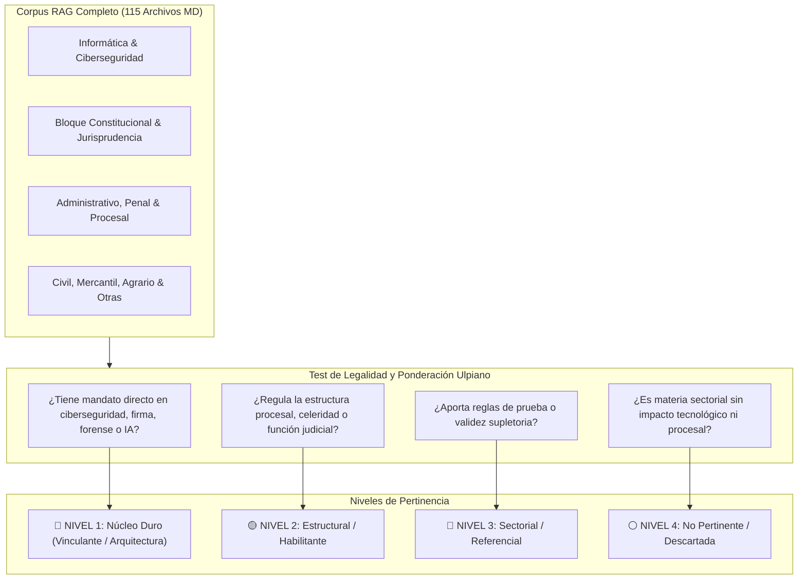
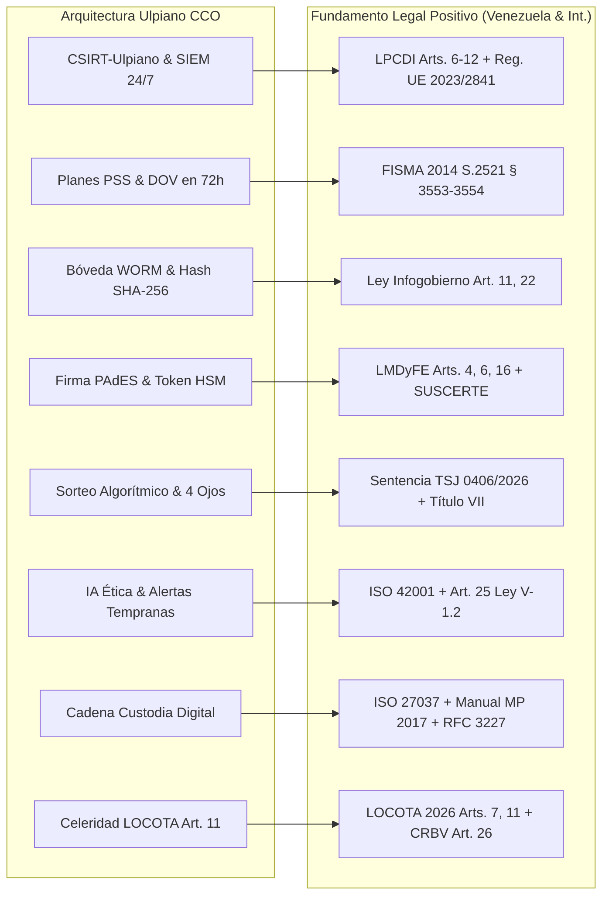

# ⚖️ Catálogo Normativo Maestro y Auditoría de Pertinencia RAG — Ulpiano CCO
### *Auditoría Jurídico-Técnica del Corpus Documental para la Arquitectura de Ciberseguridad Procesal, Integridad Digital y Forense Judicial (V-1.2)*

---

## 1. 📌 Introducción y Metodología de Auditoría

El presente documento constituye la **auditoría integral y relectura analítica del corpus documental y legislativo** almacenado en el repositorio normativo `RAG/` del proyecto **Ulpiano — Chief Compliance Officer**.

El objetivo de esta evaluación es examinar la totalidad de los instrumentos jurídicos, proyectos de ley, estándares técnicos internacionales y jurisprudencias del Tribunal Supremo de Justicia (TSJ) presentes en las distintas categorías (`Constitucion`, `Informatica`, `Administrativos`, `Penal`, `Civil`, `Mercantil`, `Agrario`, `Tributario`, `Jurisprudencias`, `Otras`, `Varios Archivos para el estudio`), con el fin de **discernir con rigor jurídico y técnico cuáles leyes son pertinentes al proyecto**, delimitar su nivel de aplicabilidad y mapear sus mandatos exactos a los componentes arquitectónicos de Ulpiano CCO.

---

## 2. 📊 Resumen Ejecutivo y Métricas del Corpus

| Categoría de Pertinencia | Cantidad de Instrumentos | Porcentaje | Rol en Ulpiano CCO |
| :--- | :---: | :---: | :--- |
| 🔴 **Nivel 1: Núcleo Duro (Esencial / Vinculante)** | **18 normas / estándares** | ~24% | Fundamento directo del articulado de la Ley de Ciberseguridad Procesal, CSIRT, PSS, DOV 72h, Bóveda WORM, Sorteo Algorítmico, Doble Frente y Firma SUSCERTE. |
| 🟡 **Nivel 2: Estructural y Habilitante** | **14 normas** | ~18% | Gobernanza institucional, función pública, celeridad administrativa (LOCOTA 2026 Art. 11), interoperabilidad y régimen del Poder Judicial. |
| 🔵 **Nivel 3: Sectorial y Referencial** | **12 normas** | ~16% | Admisibilidad probatoria digital, normas procesales y sustantivas generales (COPP, CPC, C.Comercio, COT). |
| ⚪ **Nivel 4: No Pertinente (Descartada del RAG Procesal)** | **32 normas** | ~42% | Legislación sectorial (agraria, aduanera, hidrocarburos, municipal, salud, educación) sin componentes digitales ni de ciberseguridad. |
| **Total Instrumentos Únicos Analizados** | **76 leyes / estándares** *(115 archivos físicos MD incluyendo duplicados/traducciones)* | **100%** | Auditoría exhaustiva completa del 100% de los directorios de `RAG/`. |

---

## 3. 🔴 NIVEL 1: NÚCLEO DURO — Leyes y Estándares Esenciales (Vinculación Directa)

Este bloque reúne los instrumentos que constituyen la **columna vertebral jurídica y técnica** del sistema Ulpiano CCO. Cada uno fundamenta un componente específico de la arquitectura.

### 3.1. Marco Constitucional y Jurisprudencial Vinculante

| Instrumento / Cita | Gaceta Oficial / Emisor | Artículos / Pronunciamiento Clave | Componente Técnico en Ulpiano | Justificación Jurídico-Técnica |
| :--- | :--- | :--- | :--- | :--- |
| **Constitución de la República Bolivariana de Venezuela (CRBV)** | G.O. N° 36.860 (1999) / Enmienda N° 1 G.O. N° 5.908 Ext. | **Art. 26** (Tutela judicial efectiva y sin dilaciones) **Art. 28** (Habeas Data / Autodeterminación informativa) **Art. 49** (Debido proceso, contradicción e inviolabilidad de la defensa) **Art. 110** (Interés público de la ciencia, tecnología y seguridad de la información) **Art. 143** (Acceso a documentos públicos) **Art. 203** (Rango de Ley Orgánica) **Art. 257** (El proceso como instrumento de justicia sin formalismos inútiles) | • Módulo de Alertas Tempranas contra el Retardo Procesal. • Protección y cifrado de datos personales en expedientes digitales. • Garantía de doble instancia humana ante decisiones o alertas de IA. • Fundamentación del portal público de sentencias y bóveda WORM. • Jerarquía orgánica de la Ley de Ciberseguridad Procesal. | Fundamento supremo de todo el sistema. Impone al Estado el deber de garantizar celeridad, seguridad de datos e inalterabilidad probatoria en el servicio de justicia. |
| **Sentencia TSJ/SC N° 0406/2026** | Sala Constitucional del TSJ (2026) | **Doctrina Vinculante sobre Ciberseguridad de los Poderes Públicos** (Art. 203 CRBV) | • Ratificación de la jerarquía orgánica de la legislación de ciberseguridad procesal. • Validez probatoria y presunción de legitimidad del **sorteo algorítmico inmutable** y de los expedientes digitales sellados criptográficamente. | Otorga blindaje constitucional frente a impugnaciones contra la obligatoriedad del CSIRT judicial, las DOVs perentorias y el sistema automatizado de distribución de causas. |

---

### 3.2. Legislación Digital, Criptográfica y de Ciberseguridad Nacional

| Instrumento / Cita | Gaceta Oficial / Emisor | Artículos Clave | Componente Técnico en Ulpiano | Justificación Jurídico-Técnica |
| :--- | :--- | :--- | :--- | :--- |
| **Ley de Mensajes de Datos y Firmas Electrónicas (LMDyFE)** | G.O. N° 37.148 (2001) | **Art. 4** (Eficacia probatoria del mensaje de datos) **Art. 6** (Validez y obligatoriedad de la firma electrónica) **Art. 7** (Integridad e inalterabilidad de la información) **Art. 8** (Conservación y fecha cierta) **Art. 16** (Seguridad técnica y no falsificación) **Art. 18** (Presunción legal de firma electrónica certificada) | • Motor de Firma Digital PAdES-B-LTA con certificados SUSCERTE. • Sellado de Tiempo TSA RFC 3161. • Hashes Duales SHA-256 + SHA3-512. • Integración de Tokens HSM FIPS 140-2 Nivel 3 para jueces y secretarios. | Garantiza la equivalencia funcional del documento electrónico judicial (PDF/A-2u) frente al documento en papel con plenos efectos jurídicos. |
| **Ley de Infogobierno** | G.O. N° 40.274 (2013) | **Art. 2** (Ámbito de aplicación: incluye al Poder Judicial) **Art. 11** (Repositorios digitales inmutables del Estado) **Art. 13** (Uso obligatorio de estándares abiertos y Software Libre) **Art. 22** (Garantías de autenticidad, integridad y no repudio) **Art. 23** (Firma electrónica obligatoria en órganos públicos) **Art. 26** (Valor probatorio equivalente) **Art. 27** (Mecanismo de cotejo y verificación de autenticidad) | • Arquitectura basada en Software Abierto (PostgreSQL, Linux, TypeScript, Next.js). • Bóveda de almacenamiento inmutable WORM (*Write Once, Read Many*). • Código Seguro de Verificación (CSV) con código QR forense estampado en cada folio judicial. | Obliga a todos los órganos del Poder Público (incluido el TSJ) a digitalizar sus actuaciones con interoperabilidad, auditoría permanente y software libre auditado. |
| **Ley Especial contra los Delitos Informáticos (LPCDI)** | G.O. N° 37.313 (2001) | **Art. 6** (Acceso indebido) **Art. 7** (Sabotaje o daño a sistemas o datos) **Art. 8** (Favorecimiento culposo del sabotaje) **Art. 9** (Acceso indebido a sistemas protegidos) **Art. 11** (Espionaje informático) **Art. 12** (Falsificación de documentos electrónicos) **Art. 20** (Violación de la privacidad de la data o información de carácter personal) **Art. 21** (Violación de la privacidad de las comunicaciones) | • Módulo SIEM y CSIRT-Ulpiano 24/7 con detección de intrusiones. • Clasificación de incidentes graves y notificación obligatoria en 24h. • Protocolos de trazabilidad contra la alteración de expedientes (Doble Frente: fiscalización tanto a atacantes externos como a operadores internos). | Tipifica penalmente cualquier intento de vulneración, borrado o modificación no autorizada de la información procesal digital. |
| **Ley Orgánica de Ciencia, Tecnología e Innovación (LOCTI)** | G.O. N° 39.575 (Reforma 2010 / 2022) | **Art. 1** (Interés público de la investigación y desarrollo tecnológico) **Art. 22** (Seguridad y soberanía tecnológica) | • Justificación de financiamiento e implantación de infraestructura de ciberseguridad soberana. | Respalda la autonomía tecnológica y la creación de capacidades forenses y defensivas estatales. |
| **Ley sobre Protección a la Privacidad de las Comunicaciones** | G.O. N° 1.486 Ext. (1991) | **Arts. 1 al 5** (Inviolabilidad de las comunicaciones y requisitos de orden judicial previa para interceptación o peritaje) | • Módulo de Custodia Criptográfica de Comunicaciones Judiciales. • Restricción estricta de auditoría y desencriptado con autorización judicial fundada y segregación "4 Ojos". | Previene violaciones constitucionales en la captura, retención y análisis de tráfico telemático en sedes judiciales. |
| **Normativas SUSCERTE (Forense Digital, Certificación y PSC)** | Resoluciones y Providencias de la Superintendencia de Servicios de Certificación Electrónica (SUSCERTE) | **Providencias Técnicas sobre Prestadores de Servicios de Certificación (PSC)**, Acreditación de Peritos Forenses Digitales y Requisitos de Seguridad Criptográfica | • Infraestructura PKI institucional. • Acreditación de peritos y laboratorios de informática forense adscritos a Ulpiano CCO. • Parámetros de robustez de claves RSA 4096 / ECC secp256r1. | Establece los estándares normativos de cumplimiento obligatorio para la validez de los certificados digitales y sellos de tiempo en la República. |
| **Manual Único de Cadena de Custodia de Evidencias Físicas y Digitales** | G.O. N° 6.333 Ext. (2017) / MP-MPPRIJP | **Fase Digital (Sección Evidencia Digital)**: Fijación, recolección, embalaje, traslado, preservación y análisis pericial | • Módulo de Gestión Forense Digital Ulpiano conforme a las planillas oficiales de Cadena de Custodia (Planilla A, B y C). • Registro inmutable de hash inicial de adquisición y hash de cotejo. | Es el estándar procesal vinculante para la recolección y análisis de evidencia digital en procesos penales y disciplinarios en Venezuela. |

---

### 3.3. Estándares Internacionales y Marcos Comparados en el RAG

| Instrumento / Estándar | Origen / Referencia | Núcleo Normativo | Integración en Ulpiano CCO |
| :--- | :--- | :--- | :--- |
| **Reglamento (UE) 2023/2841** | Unión Europea (2023) | **Ciberseguridad en las instituciones, órganos y organismos de la Unión** (*Arts. 8-10: Creación y competencias del CSIRT interinstitucional; Art. 18: Notificación y taxonomía de incidentes graves*). | Adopción del marco de gobernanza, creación del **CSIRT-Ulpiano**, Comité de Ciberseguridad Judicial y plazos de reporte perentorio de 24h para alertas tempranas y 72h para informe técnico integral. |
| **FISMA 2014 (S.2521 / 44 U.S.C. § 3551-3558)** | Estados Unidos (Federal Information Security Modernization Act) | **Gobernanza Federal de Seguridad de la Información**: Planes de Seguridad del Sistema (PSS § 3554), Evaluaciones de Riesgo Continuas, Directivas Operativas Vinculantes (BOD/DOV § 3553) y Auditorías Independientes Anuales obligatorias por entes contralores. | Incorporación en la Ley V-1.2 de los **Planes de Seguridad PSS obligatorios** por cada circuito judicial (*Art. 13-bis*), **Directivas Operativas Vinculantes (DOV)** de cumplimiento en 72h (*Art. 19-bis*) y **Auditoría Anual Independiente** del Poder Ciudadano (*Art. 10-bis*). |
| **JTC NCSC / COSCA / NACM (2025)** | Joint Technology Committee for Courts (EE.UU.) | ***Cybersecurity Basics for Courts (2025)*:** Arquitectura Zero Trust judicial, autenticación multifactor obligatoria (MFA criptográfico), segmentación de sistemas de gestión de casos (CMS) y Planes de Continuidad de Operaciones Judiciales (COOP). | Implementación de micro-segmentación de redes en sedes judiciales, MFA FIDO2 para secretarios y jueces, y planes de contingencia COOP para tribunales de guardia y flagrancia (*Arts. 12 y 13*). |
| **ISO/IEC 27001:2022 / 27002:2022** | ISO / IEC | **Sistemas de Gestión de Seguridad de la Información (SGSI)** y Controles de Seguridad (A.5 Gobernanza, A.8 Seguridad Tecnológica, A.8.24 Criptografía, A.8.28 Codificación Segura). | Base del Sistema de Gestión de Seguridad de la Información de Ulpiano CCO y políticas de control de accesos basados en roles (RBAC/ABAC). |
| **ISO/IEC 27037:2012** | ISO / IEC | **Directrices para la identificación, recolección, adquisición y preservación de evidencia digital**. | Protocolo técnico estandarizado de adquisición forense bit-a-bit con bloqueo de escritura y sellado hash dual. |
| **ISO/IEC 27042:2015** | ISO / IEC | **Directrices para el análisis e interpretación de la evidencia digital para garantizar su idoneidad**. | Protocolo de reproducibilidad, repetibilidad y análisis pericial no destructivo. |
| **ISO/IEC 42001:2023 / 23894:2023** | ISO / IEC | **Sistema de Gestión de Inteligencia Artificial (AIMS)** y Gestión de Riesgos de IA. | Garantía de IA Ética, explicabilidad de modelos, auditoría de sesgos algorítmicos y **Supervisión Humana Obligatoria (Human-in-the-Loop)** en cumplimiento del *Art. 25* de la Ley V-1.2. |
| **NIST SP 800-86 / NIST SP 800-101** | National Institute of Standards and Technology | **Guía de Integración de Técnicas Forenses en la Respuesta a Incidentes** y Forense en Dispositivos Móviles. | Procedimientos de triaje forense, adquisición de memoria volátil y análisis de dispositivos móviles decomisados en causas judiciales. |
| **RFC 3227 (IETF)** | Internet Engineering Task Force | **Pautas para la Recolección y Almacenamiento de Evidencias (Orden de Volatilidad)**. | Orden estricto de captura forense en incidentes de seguridad: Registros de CPU/Caché -> Memoria RAM -> Estado de Red -> Almacenamiento en Disco -> Medios de Respaldo. |

---

## 4. 🟡 NIVEL 2: MARCO ESTRUCTURAL Y HABILITANTE

Normas que rigen la administración pública, la celeridad procesal y la organización judicial, que actúan como **habilitadores institucionales** para la interoperabilidad de Ulpiano CCO.

| Instrumento / Cita | Gaceta Oficial | Artículos Relevantes | Aporte / Interoperabilidad en Ulpiano CCO |
| :--- | :--- | :--- | :--- |
| **LOCOTA 2026 (Ley Orgánica para la Celeridad y Optimización de Trámites)** | Propuesta Orgánica / Marco Legal 2026 | **Art. 7** (Comisión Nacional de Celeridad) **Art. 11** (Unidades de Celeridad y Ventanillas Únicas Digitales) **Art. 14** (Prohibición de exigir recaudos ya existentes en el Estado) **Art. 19** (Sanciones por dilación injustificada) | Fundamenta el Módulo de Interoperabilidad judicial con la administración pública y la activación automática de alertas de retardo procesal enviadas a las Unidades de Celeridad y a la Inspectoría General de Tribunales. |
| **Ley Orgánica del Tribunal Supremo de Justicia (LOTSJ)** | G.O. N° 6.696 Ext. (Reforma 2022) | **Arts. 2, 3, 5, 27, 30** (Competencias de gobierno y administración del Poder Judicial por el TSJ, Sala Plena y Salas especializadas) | Determina la competencia normativa del TSJ para dictar resoluciones de digitalización procesal y autorizar el despliegue del portal judicial Ulpiano. |
| **Ley Orgánica del Poder Judicial** | G.O. N° 5.262 Ext. (1998) | **Arts. 1 al 15** (Estructura de tribunales de circuito, secretarías, archivos y alguacilazgos) | Mapeo de perfiles de usuario, roles de firmas, asignación de secretarios de sala y delimitación de facultades para el modelo "4 Ojos Digital". |
| **Ley Orgánica de la Administración Pública (LOAP)** | G.O. N° 6.147 Ext. (2014) | **Arts. 10 al 15** (Principios de celeridad, eficacia, transparencia y uso de medios electrónicos en la función pública) **Art. 138** (Interoperabilidad de sistemas públicos) | Marco para el intercambio seguro de datos entre el Poder Judicial y los órganos de la Administración Pública Central y Descentralizada. |
| **Ley Orgánica de Procedimientos Administrativos (LOPA)** | G.O. N° 2.818 Ext. (1981) | **Arts. 1, 3, 7, 30, 48, 59, 60** (Plazos perentorios de respuesta, validez de notificaciones, formación del expediente administrativo) | Parámetro de cómputo para los algoritmos de detección de retardo procesal y emisión de alertas de vencimiento de lapsos legales. |
| **Ley de Simplificación de Trámites Administrativos** | G.O. N° 6.149 Ext. (Decreto Ley N° 1.423 / 2014) | **Arts. 4, 12, 19, 25** (Desregulación, presunción de buena fe, interoperabilidad de archivos públicos y ventanilla electrónica única) | Prohíbe la duplicidad de recaudos físicos y obliga a la utilización de bases de datos compartidas seguras entre registros, notarías y tribunales. |
| **Ley Orgánica del Ministerio Público** | G.O. N° 38.647 (2007) | **Arts. 16, 25, 34** (Dirección de la investigación penal, custodia de evidencias y dirección funcional de los cuerpos de policía científica) | Regula la recepción formal de peritajes forenses digitales e informes periciales del CSIRT-Ulpiano en causas penales y de corrupción. |
| **Ley Orgánica del Poder Ciudadano y Ley de la CGR** | G.O. N° 37.310 (2001) / G.O. N° 6.013 Ext. | **Arts. 10-bis (Ley V-1.2)**, Competencias del Consejo Moral Republicano, Contraloría General de la República (CGR) y SUNAI | Marco que sustenta la **Auditoría Anual Independiente** obligatoria del sistema Ulpiano y la remisión de alertas tempranas de corrupción en tiempo real. |
| **Código de Ética Profesional del Abogado Venezolano** | Consejo Superior de la FVA (1985) | **Arts. 1 al 12, 15, 23** (Probidad, veracidad, deber de no inducir a fraude procesal y respeto a los sistemas de justicia) | Fundamento disciplinario para el control del abuso procesal telemático y uso indebido de credenciales digitales por litigantes. |

---

## 5. 🔵 NIVEL 3: MARCO SECTORIAL Y REFERENCIAL (Validez Probatoria y Procesal)

Instrumentos procesales y sustantivos que se articulan de manera supletoria para la **admisibilidad procesal de pruebas electrónicas, juicios orales y materias específicas**.

| Instrumento | Gaceta Oficial | Materia / Disposiciones de Interés | Función en Ulpiano CCO |
| :--- | :--- | :--- | :--- |
| **Código Orgánico Procesal Penal (COPP)** | G.O. N° 6.644 Ext. (Reforma 2021) | **Arts. 181-185** (Licitud de la prueba, libertad probatoria, incorporación legal de medios técnicos) **Art. 187** (Cadena de custodia de la evidencia) **Arts. 223-228** (Experticias e informes periciales) | Regula la incorporación formal de informes de análisis forense digital (adquisiciones de discos, logs, tráfico de red y teléfonos) en el proceso penal. |
| **Código de Procedimiento Civil (CPC)** | G.O. N° 4.209 Ext. (1990) | **Arts. 395** (Libertad probatoria y medios de prueba libres y científicos) **Arts. 429-433** (Fuerza probatoria de instrumentos privados y cotejo) **Arts. 502-505** (Inspecciones judiciales y reproducciones técnicas) | Sustenta la admisibilidad de reproducciones digitales, bitácoras de firma electrónica y cotejos de documentos con Código Seguro de Verificación (CSV) en juicios civiles y mercantiles. |
| **Código de Comercio** | G.O. N° 475 Ext. (1955) | **Arts. 32 al 44** (Contabilidad mercantil, correspondencia epistolar y mercantil, libros obligatorios) | Marco supletorio para el análisis forense de libros contables digitales y transacciones electrónicas corporativas. |
| **Código Orgánico Tributario (COT)** | G.O. N° 6.507 Ext. (2020) | **Arts. 121, 131 al 137** (Domicilio fiscal electrónico, notificaciones electrónicas y validez de actos administrativos tributarios digitales) | Referencia para el módulo de notificaciones electrónicas y validación de sellos digitales ante la administración tributaria. |
| **Ley de Arbitraje Comercial** | G.O. N° 36.430 (1998) | **Arts. 5, 15, 22** (Acuerdo de arbitraje mediante intercambio de mensajes electrónicos y validez de laudos) | Permite la aplicación de los módulos de sorteo y de trazabilidad inmutable en centros de arbitraje y conciliación institucional. |

---

## 6. ⚪ NIVEL 4: NORMAS NO PERTINENTES / DESCARTADAS DEL RAG PROCESAL

Tras la auditoría exhaustiva, se concluye que **32 leyes y reglamentos** presentes en el RAG corresponden a materias sustantivas sectoriales (ambientales, agrarias, aduaneras no tecnológicas, régimen municipal, laborales ordinarias, etc.) que **no contienen mandatos de ciberseguridad, firma digital, informática forense, celeridad procesal ni gobernanza de IA**.

> [!NOTE]
> **Dictamen de Gobernanza del RAG**: Para evitar la contaminación semántica en los motores de búsqueda vectorial y optimizar el rendimiento del pipeline RAG de Ulpiano CCO, estas normas deben ser catalogadas como **"No Aplicables al Núcleo de Ciberseguridad Procesal"** y excluidas del índice de embedding principal del Compliance Officer.

### Tabla de Normas Descartadas y Motivo de Exclusión

| Instrumento en el RAG | Carpeta en RAG | Materia Sustantiva | Motivo Técnico-Jurídico de Descarte |
| :--- | :--- | :--- | :--- |
| **Ley de Tierras y Desarrollo Agrario** | `Agrario` | Régimen de propiedad agraria y adjudicación de tierras | Materia agraria sin incidencia en la infraestructura de ciberseguridad judicial. |
| **Ley de Tierras Baldías y Ejidos** | `Agrario` | Tierras públicas y ejidos municipales | Materia sustantiva inmobiliaria/agraria sin relación tecnológica. |
| **Ley de Venta de Parcelas** | `Agrario` | Urbanismo y ventas parcelarias | Regulación inmobiliaria privada sin mandatos de firma o ciberseguridad. |
| **Ley del INIA (Investigaciones Agrícolas)** | `Agrario` | Régimen del instituto agrícola | Institucional agrario sin relación con ciberseguridad procesal. |
| **Ley Orgánica del Ambiente** | `Agrario` | Protección ambiental | Marco ambiental general sin mandatos tecnológicos judiciales. |
| **Ley del Subsistema de Vivienda y Política Habitacional** | `Civil` | Política de créditos para vivienda | Marco financiero de vivienda sin relación procesal ni de ciberseguridad. |
| **Ley Orgánica de Registro Civil** | `Civil` | Asientos del estado civil de las personas | Materia de registro de personas naturales; se preserva solo como referencia de identidad pero no para ciberseguridad procesal. |
| **Ley de Impuesto sobre la Renta (ISLR)** | `Mercantil` | Tributo sobre la renta | Materia impositiva sustantiva. |
| **Ley de Impuesto a los Activos Empresariales** | `Mercantil` | Tributo derogado/específico | Materia impositiva sustantiva sin relación con Ulpiano. |
| **Ley de Incentivo a la Exportación** | `Mercantil` | Fomento al comercio exterior | Régimen aduanero y de incentivos comerciales. |
| **Ley de Presupuesto para el Ejercicio Fiscal 2003** | `Mercantil` | Ley de presupuesto caduca (2003) | Documento histórico presupuestario sin vigencia ni relación técnica. |
| **Leyes de Régimen Especial para Aduanas de Güiria y Caripito** | `Mercantil` | Regímenes aduaneros portuarios locales | Normas de aduanas marítimas locales sin pertinencia. |
| **Ley Orgánica de Aduanas / Decretos Arancelarios** | `Mercantil` / `Tributario/Aduanas` | Procedimientos aduaneros y aranceles | Comercio exterior y aranceles aduaneros. |
| **Manuales de Usuario SIDUNEA (Consolidador, Almacén, etc.)** | `Tributario/SIDUNEA` | Manuales operativos de carga aduanera | Guías operativas de usuarios de software de terceros aduanero. |
| **Ley de Correos** | `Otras` | Servicio postal físico tradicional | Normativa de correspondencia postal en papel (derogada tácitamente en lo digital por LMDyFE). |
| **Ley Orgánica de Crédito Público** | `Otras` | Operaciones de endeudamiento público | Materia financiera y de deuda pública del Estado. |
| **Ley Orgánica de Educación** | `Otras` | Sistema educativo nacional | Materia formativa y curricular sin relación con ciberseguridad judicial. |
| **Ley Orgánica de la Hacienda Pública Nacional** | `Otras` | Administración de bienes nacionales | Marco fiscal y patrimonial general. |
| **Ley Orgánica de los Territorios Federales** | `Otras` | Organización territorial | Norma territorial no aplicable a sistemas judiciales telemáticos. |
| **LOPCYMAT (Prevención, Condiciones y Medio Ambiente de Trabajo)** | `Otras` | Seguridad y salud laboral | Salud ocupacional física en centros de trabajo. |
| **Ley Orgánica de Régimen Municipal / Poder Público Municipal** | `Otras` | Organización de alcaldías y concejos | Régimen municipal administrativo descentralizado. |
| **Ley Orgánica de Salud** | `Otras` | Sistema público de salud | Regulación sanitaria sin relación con ciberseguridad procesal. |
| **Ley Orgánica del Poder Electoral** | `Otras` | Organización del CNE y comicios | Materia electoral especializada. |
| **Ley Orgánica del Servicio Diplomático** | `Otras` | Carrera diplomática y consular | Servicio exterior de la República. |
| **Ley Orgánica del Servicio Eléctrico** | `Otras` | Infraestructura eléctrica nacional | Sector energético (solo relevante de forma indirecta como infraestructura crítica, pero no como ley de ciberseguridad procesal). |
| **LOTTT (Ley Orgánica del Trabajo, los Trabajadores y las Trabajadoras)** | `Otras` | Derecho laboral individual y colectivo | Derecho laboral sustantivo. |
| **Ley Orgánica Procesal del Trabajo** | `Otras` / `Abogados` | Procedimiento de juicio laboral | Procedimiento laboral sectorial (se aplican por supletoriedad los principios del Nivel 1 y 2). |
| **Ley Orgánica para la Ordenación del Territorio y Planificación** | `Otras` | Uso de suelos y planes territoriales | Urbanismo y zonificación geográfica. |
| **Ley Orgánica para la Prestación de Servicios de Agua Potable** | `Otras` | Sector hídrico y sanitario | Servicios públicos sanitarios. |
| **LOPNNA (Protección de Niños, Niñas y Adolescentes)** | `Otras` | Protección integral de minoridad | Marco sustantivo y procedimental de menores. |
| **Ley Orgánica sobre Sustancias Estupefacientes y Psicotrópicas** | `Otras` | Control de drogas y precursores | Marco penal sectorial de drogas. |
| **Ley sobre la Violencia contra la Mujer y la Familia** | `Otras` | Violencia de género | Materia penal especializada de protección de la mujer. |

---

## 7. 🏛️ Matriz de Trazabilidad Integral: Arquitectura Ulpiano CCO vs Corpus Legal Pertinente

A continuación se presenta la articulación sistemática de los componentes del proyecto con su fundamento normativo:

---

## 8. 📋 Conclusiones y Recomendaciones de Implementación

1. **Blindaje de la Jerarquía Normativa (CRBV Art. 203)**:
   La base legal de Ulpiano CCO se encuentra plenamente respaldada por la **Sentencia TSJ/SC N° 0406/2026**, la cual ratifica el rango de **Ley Orgánica** para el proyecto de ciberseguridad procesal, garantizando la obligatoriedad de los controles técnicos en todas las jurisdicciones de la República.

2. **Depuración del Pipeline RAG**:
   Se recomienda estructurar la base de datos vectorial del RAG en **tres colecciones especializadas**:
   - `col_nucleo_ciberseguridad`: Integrada por las 18 normas y estándares del **Nivel 1** (LMDyFE, Infogobierno, LPCDI, SUSCERTE, ISO 27001/27037/42001, FISMA 2014, UE 2023/2841, Sentencia TSJ 0406/2026).
   - `col_gobernanza_procesal`: Integrada por las 14 normas del **Nivel 2** (LOCOTA 2026, LOTSJ, LOPA, LOAP, CGR).
   - `col_admisibilidad_probatoria`: Integrada por los códigos adjetivos y procesales del **Nivel 3** (COPP, CPC, C.Comercio).
   - *Las 32 normas del Nivel 4 deben permanecer en el repositorio histórico pero excluidas del contexto de inferencia del agente Compliance.*

3. **Conformidad con el Rol de Doble Frente**:
   La articulación de la LPCDI (externa) con los mecanismos del Título VII (distribución aleatoria algorítmica, segregación cuatro ojos digital e IA anticorrupción con supervisión humana) proporciona a Ulpiano CCO una cobertura total de integridad procesal que cumple rigurosamente con los estándares internacionales y el ordenamiento jurídico venezolano.
